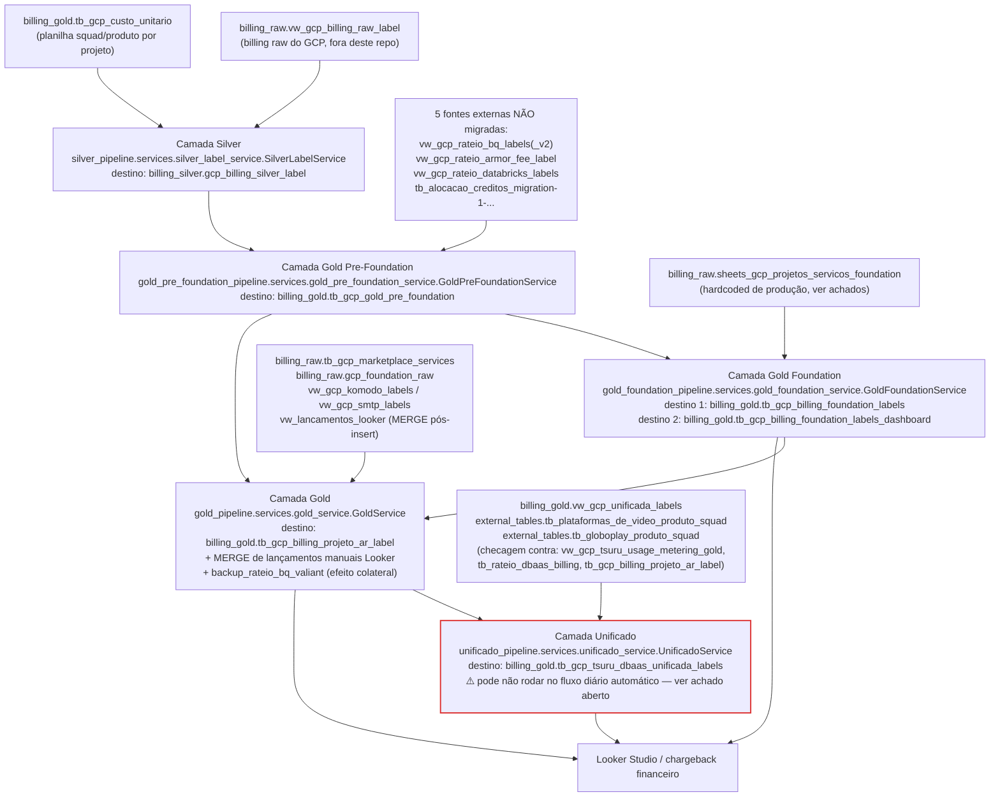
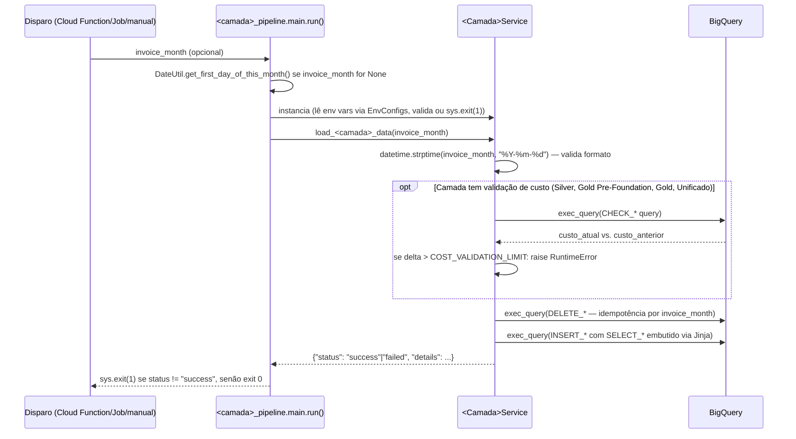

# Arquitetura — finops-billing

> Lido para escrever este documento: todo o código de `libs/billing_common/src/billing_common/`
> (adapters/bigquery.py, config/base.py, dates/date_util.py, logging/json_logger.py, secrets/),
> todos os `services/*.py`, `main.py`, `config/env_configs.py` e `README.md` das 5 camadas do
> medalhão (`silver`, `gold_pre_foundation`, `gold_foundation`, `gold`, `unificado`), todo
> `terraform/modules/` e `terraform/environments/{dev,prod}/`, `.gitlab-ci.yml`,
> `pyproject.toml` (raiz e de cada pacote), `ruff.toml`. Testes executados localmente para
> confirmar comportamento real (ver seção "O que foi validado por execução" ao final).

## 1. Visão geral

O `finops-billing` consolida o billing multicloud da Globo (GCP, AWS, Azure, OCI, Tsuru, DBaaS)
para dois consumidores finais: **chargeback financeiro** (rateio de custo por centro de
custo/projeto/squad) e **dashboards Looker Studio**. Este repositório é a modernização do
legado `gcp-billing`, com foco atual exclusivo na migração do pipeline `gcp_labels` (5 camadas
medalhão).

**Exemplo concreto de fluxo ponta a ponta**: todo dia, o billing raw do GCP do dia anterior
(`billing_raw.vw_gcp_billing_raw_label`) precisa ganhar labels de negócio (squad/produto), ser
rateado entre múltiplas fontes de custo compartilhado (BQ, Cloud Armor, Databricks), filtrado
para os projetos "Foundation", rateado proporcionalmente entre AR/projeto e finalmente
combinado com o billing da Tsuru e dos DBaaS — para que, no dia seguinte, um analista financeiro
veja no Looker Studio quanto cada squad gastou no mês corrente, em qualquer provedor.

## 2. Arquitetura — fluxo origem → transformação → destino

### 2.1 As 5 camadas do medalhão `gcp_labels` (migradas)



## 3. Componentes e seu papel real (confirmado por leitura de código)

| Componente | Papel real | Onde está |
|---|---|---|
| `BigQueryAdapter` | Único adapter de serviço externo usado pelas 5 camadas do medalhão. Funde DDL (`create_table`, `delete_table`, `update_table_schema_if_necessary`, `get_table`) com execução de query (`exec_query`, com `labels` para FinOps tagging) e submissão assíncrona (`query`). | `libs/billing_common/src/billing_common/adapters/bigquery.py:37` |
| `BaseEnvConfigs` | Validação de variáveis de ambiente obrigatórias. Recebe `expected_envs` no construtor; cada camada cria subclasse fina. Em caso de variável faltante, **encerra o processo com `sys.exit(1)`** (não levanta exceção Python) — paridade deliberada com o legado, pensada para falhar visível em log de Cloud Function/Cloud Run. | `libs/billing_common/src/billing_common/config/base.py:24` |
| `DateUtil` | Cálculo de primeiro/último dia do mês, mês anterior, lista de meses em um intervalo. Usado apenas pela camada Silver (cálculo de janela de partição) e pelos `main.py` de todas as camadas (default de `invoice_month`). | `libs/billing_common/src/billing_common/dates/date_util.py:28` |
| `build_logger` | Logger estruturado em JSON via stdout, compatível nativamente com Cloud Logging (sem usar `google-cloud-logging` client). Idempotente quanto a handlers duplicados. | `libs/billing_common/src/billing_common/logging/json_logger.py:44` |
| `SilverLabelService` | Aplica labels squad/produto sobre o billing raw, valida paridade de custo raw vs. silver, grava em `gcp_billing_silver_label`. | `pipelines/silver/src/silver_pipeline/services/silver_label_service.py:46` |
| `GoldPreFoundationService` | Pré-rateio (`UNION ALL` com 5 fontes externas), cálculo de `custo`/`creditos`/`credito_cud`/`ajuste`/`custo_suporte`/`credito_suporte`, resolução de hierarquia de centro de custo. | `pipelines/gold_pre_foundation/src/gold_pre_foundation_pipeline/services/gold_pre_foundation_service.py:59` |
| `GoldFoundationService` | Filtra projetos Foundation, classifica `ambiente` (produção/QA/dev/POC/marketplace), grava em 2 tabelas (linha a linha + dashboard agregado). Sem validação de custo. | `pipelines/gold_foundation/src/gold_foundation_pipeline/services/gold_foundation_service.py:36` |
| `GoldService` | Rateio Foundation proporcional, valida paridade de custo contra Gold Pre-Foundation, grava em `tb_gcp_billing_projeto_ar_label`, faz `MERGE` de lançamentos Looker e roda backup de pesos de rateio BQ fora da org. | `pipelines/gold/src/gold_pipeline/services/gold_service.py:41` |
| `UnificadoService` | Consolida GCP+Tsuru+DBaaS, valida soma por provedor contra 3 fontes "gold" independentes. | `pipelines/unificado/src/unificado_pipeline/services/unificado_service.py:66` |
| Terraform `bigquery_table`, `cloud_run_job`, `cloud_scheduler_http`, `secret_manager_secret` | Módulos reutilizáveis, sem nenhuma instância em `terraform/environments/{dev,prod}/` hoje. Pensados para serem chamados pelos mesmos módulos em dev e prod (sem a assimetria do Terraform legado) quando o deploy das camadas do medalhão for implementado. | `terraform/modules/` |

## 4. Serviços externos GCP realmente usados (confirmado por leitura de adapters)

- **BigQuery** (`google.cloud.bigquery`) — leitura e escrita de dados em todas as 5 camadas do
  medalhão. É o único cliente de serviço GCP com uso real hoje em `billing_common`.
- **Secret Manager** (`google.cloud.secretmanager`) — cliente disponível em
  `billing_common.secrets.secret_manager.get_secret_json`
  (`libs/billing_common/src/billing_common/secrets/secret_manager.py`), como infraestrutura
  reutilizável para pipelines futuros, sem consumidor real ainda dentro das 5 camadas do
  medalhão.
- **Cloud Run Jobs** e **Cloud Scheduler** — módulos Terraform reutilizáveis existem
  (`terraform/modules/cloud_run_job`, `cloud_scheduler_http`), mas nenhuma instância está
  provisionada hoje. As 5 camadas do medalhão não têm nenhum recurso de deploy real no GCP neste
  repositório.
- **Cloud Storage (GCS)** — não há nenhum adapter, import ou referência a GCS em
  `libs/billing_common` nem em nenhum pipeline. O único uso de "gcs" no repositório é o backend
  Terraform genérico (`backend "gcs" {}` em `terraform/environments/dev/provider.tf:14` e
  equivalente em prod), sem bucket nomeado no código — configuração de backend remoto do
  próprio Terraform, não um adapter de dados.
- **Cloud Logging** — não há cliente de Cloud Logging (`google-cloud-logging`); o logger emite
  JSON em stdout, e o parsing é feito pelo agente do Cloud Logging/Cloud Run automaticamente.

## 5. Fluxo de execução de cada camada do medalhão (padrão comum)

Todas as 5 camadas seguem exatamente o mesmo padrão estrutural — confirmado lendo os 5
`services/*.py` e `main.py`:



**Padrão de idempotência**: todas as camadas fazem `DELETE WHERE invoice_month = ...` antes do
`INSERT` — rodar a mesma camada duas vezes para o mesmo mês não duplica dados (reprocessamento
seguro). Confirmado em `silver_label_service.py:131` (`delete_data`),
`gold_pre_foundation_service.py:145`, `gold_foundation_service.py:112`, `gold_service.py:126`,
`unificado_service.py:92`.

**Exceções ao padrão comum**:
- `GoldFoundationService` não tem validação de custo nem `check_*` — aceita `bypass_validation`
  no construtor mas nunca o usa (`gold_foundation_service.py:39`, confirmado código órfão).
- `GoldService` roda um efeito colateral extra incondicional ao final
  (`backup_rateio_bq_valiant`, `gold_service.py:174`) que escreve numa tabela hardcoded de
  produção, independentemente do ambiente.
- `UnificadoService` é a única camada que **não passa `labels=` em `exec_query`** — seus jobs
  BigQuery não aparecem com a tag `finops-workflow-layer` em
  `INFORMATION_SCHEMA.JOBS_BY_PROJECT` (`unificado_service.py:102`, `:115`).

## 6. Dependências externas fora de escopo desta migração (lidas, não migradas)

Confirmado por leitura de cada `README.md` de camada — estas views/tabelas continuam sendo
referenciadas via SQL, mas seu próprio pipeline de geração **não foi migrado** para este
repositório:

| Camada consumidora | View/tabela externa não migrada |
|---|---|
| Gold Pre-Foundation | `billing_gold.vw_gcp_rateio_bq_labels`, `vw_gcp_rateio_bq_labels_v2`, `vw_gcp_rateio_armor_fee_label`, `vw_gcp_rateio_databricks_labels`, `tb_alocacao_creditos_migration-1-1747074799001` |
| Gold Foundation | `billing_raw.sheets_gcp_projetos_servicos_foundation` (lida com projeto **hardcoded** `gglobo-billing-hdg-prd`, não o `project_id` configurado) |
| Gold | `billing_raw.sheets_gcp_projetos_servicos_foundation`, `billing_raw.tb_gcp_marketplace_services`, `billing_raw.gcp_foundation_raw`, `billing_gold.vw_gcp_komodo_labels`, `billing_gold.vw_gcp_smtp_labels`, `billing_gold.vw_lancamentos_looker` |
| Unificado | `billing_gold.vw_gcp_unificada_labels`, `external_tables.tb_plataformas_de_video_produto_squad`, `external_tables.tb_globoplay_produto_squad`; checagem cruzada contra `vw_gcp_tsuru_usage_metering_gold`, `tb_rateio_dbaas_billing`, `tb_gcp_billing_projeto_ar_label` |

## 7. O que foi validado por execução (não apenas leitura)

A suíte de testes foi executada localmente (`.venv` do próprio repositório, Python 3.12):

```
uv run pytest -q
# 101 passed
```

## 8. Achado aberto de maior risco (não resolvido — não decidir sozinho)

No legado (`gcp_labels/main.py`), o branch `pre_dbaas_tsuru` — modo padrão de produção,
disparado diariamente pela Cloud Function `gcp-cost-with-labels` via
`gcp-workflow-labels-trigger` + Cloud Scheduler — executa Silver → Gold Pre-Foundation → Gold
Foundation → Gold, mas **não chama a camada Unificado**. Apenas os branches `layer=None`
(pipeline completa) e `layer="unificado"` (execução isolada) chamam
`load_gold_unificado_data`. Isso significa que **`tb_gcp_tsuru_dbaas_unificada_labels` pode não
estar sendo atualizada pelo fluxo automático diário em produção hoje**.

Esta migração **não decide** se isso é bug do legado a corrigir ou comportamento intencional
(talvez exista outro job/cron não identificado que dispare a camada Unificado separadamente).
Confirmar com o time de negócio/owner do legado antes de definir o agendamento desta camada no
novo ambiente — ver também `pipelines/unificado/README.md` e `CLAUDE.md`.
