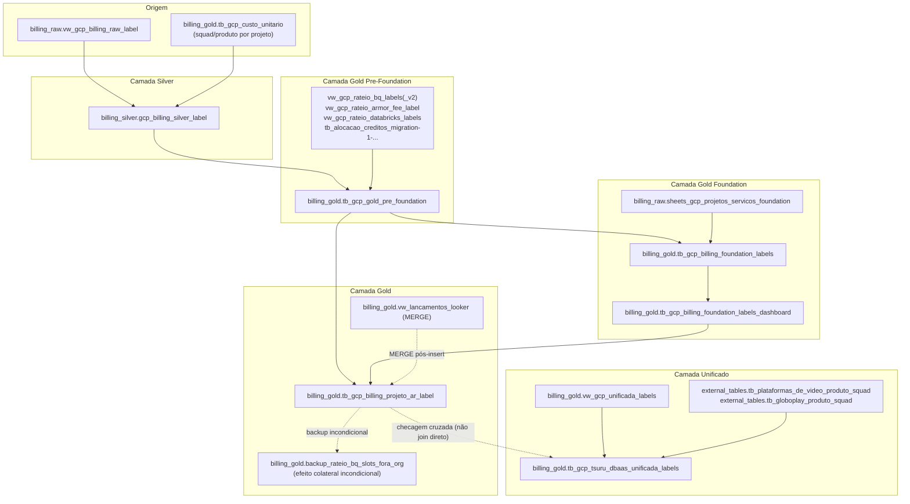

# Fluxo de dados — finops-billing

> Lido para escrever este documento: `templates/*.py` (SQL real) das 5 camadas do medalhão,
> `services/*.py` correspondentes, `.env.example` de cada camada (nomes reais de tabela) e os
> `README.md` de cada `pipelines/<camada>/`. Nomes de tabela abaixo são citados exatamente como
> aparecem nos templates SQL e nos `.env.example` — não foram copiados do `CLAUDE.md` sem
> confirmação.

## Visão consolidada (tabelas reais, confirmadas no código)

| Camada | Service | Tabela(s) de destino real | Tabela/view de origem principal |
|---|---|---|---|
| Silver | `SilverLabelService` | `billing_silver.gcp_billing_silver_label` (env `GCP_SILVER_LABEL_TABLE`) | `{project_id}.billing_raw.vw_gcp_billing_raw_label` + `gglobo-billing-hdg-prd.billing_gold.tb_gcp_custo_unitario` (planilha squad/produto, projeto **hardcoded**) |
| Gold Pre-Foundation | `GoldPreFoundationService` | `billing_gold.tb_gcp_gold_pre_foundation` (env `GCP_GOLD_LABEL_PRE_FOUNDATION_TABLE`) | `GCP_SILVER_LABEL_TABLE` (a Silver **com** label) `UNION ALL` 5 views/tabelas de rateio externas |
| Gold Foundation | `GoldFoundationService` | `billing_gold.tb_gcp_billing_foundation_labels` **e** `billing_gold.tb_gcp_billing_foundation_labels_dashboard` | `GCP_GOLD_LABEL_PRE_FOUNDATION_TABLE` + `billing_raw.sheets_gcp_projetos_servicos_foundation` (hardcoded prod) |
| Gold | `GoldService` | `billing_gold.tb_gcp_billing_projeto_ar_label` (env `GCP_GOLD_LABEL_TABLE`) | `GCP_GOLD_LABEL_PRE_FOUNDATION_TABLE` + `GCP_GOLD_LABEL_FOUNDATION_DASHBOARD_TABLE` + várias views externas |
| Unificado | `UnificadoService` | `billing_gold.tb_gcp_tsuru_dbaas_unificada_labels` (env `GCP_GOLD_UNIFICADO_LABEL_TABLE`) | `billing_gold.vw_gcp_unificada_labels` + 2 tabelas `external_tables.*` |

Os nomes de tabela confirmam exatamente os citados no `CLAUDE.md`
(`gcp_billing_silver_label`, `tb_gcp_gold_pre_foundation`,
`tb_gcp_billing_foundation_labels[_dashboard]`, `tb_gcp_billing_projeto_ar_label`,
`tb_gcp_tsuru_dbaas_unificada_labels`) — sem divergência entre documentação de negócio e código.

## Diagrama de dependências entre camadas

## Detalhe por camada

### Silver (`pipelines/silver/`)

- **Origem**: `{project_id}.billing_raw.vw_gcp_billing_raw_label`, filtrado por
  `DATE(raw.PARTITION_TIME) BETWEEN partition_start AND partition_end` e
  `raw.invoice_month = invoice_month`. Janela de partição calculada por
  `generate_partition_limit_from_invoice_month`: 17 dias antes do primeiro dia do mês até 10
  dias depois do último dia do mês (`silver_label_service.py:42-43`,
  `_PARTITION_DAYS_BEFORE = 17`, `_PARTITION_DAYS_AFTER = 10`).
- **Transformação**: resolve `labels` (squad/produto) com 5 regras de precedência conforme a GCP
  já trouxer ou não as labels `produto`/`squad` nativamente (ver `SELECT_RAW_LABEL_DATA` em
  `templates/silver_query.py:57-119`). Agrega por `GROUP BY ALL`.
- **Validação de paridade**: soma `custo + creditos` da Silver deve bater com a soma
  `cost + credits_amount` do raw na mesma janela, com tolerância de `COST_VALIDATION_LIMIT`
  (default 15000, configurável). Diferença `>= 0.01` mas dentro do limite gera apenas um
  `details` informativo no retorno; diferença `> limit` levanta `RuntimeError` e bloqueia o load
  (`silver_label_service.py:125-129`).
- **Destino**: `INSERT INTO {gcp_silver_label_table}` com 41 colunas nomeadas explicitamente
  (`templates/silver_query.py:124-184`).
- **Hardcode histórico**: bloco `gcp_corrections` injeta uma linha fixa de ajuste financeiro de
  R$ 400.541,37 exclusivamente quando `invoice_month = '2023-12-01'` (`silver_query.py:32-56`).

### Gold Pre-Foundation (`pipelines/gold_pre_foundation/`)

- **Origem**: `GCP_SILVER_LABEL_TABLE` (a Silver **com** label — atenção, não confundir com
  `gcp_billing_silver` sem label, que está fora de prioridade de migração) combinada via
  `UNION ALL` com 5 fontes de rateio externas não migradas.
- **Transformação**: calcula `custo`, `creditos`, `credito_cud`, `ajuste`, `custo_suporte`,
  `credito_suporte`; resolve `cc` (centro de custo), `workstream`, `iniciativa` e hierarquia
  organizacional via joins.
- **Validação**: compara `custo_gold + creditos_gold` (a query principal já calculada) contra
  `custo_silver + creditos_silver` (a fonte). Mesmo padrão de threshold de Silver.
- **Destino**: `billing_gold.tb_gcp_gold_pre_foundation`.
- **Achado de código órfão confirmado**: `CUSTO_UNITARIO_FIELDS` e os métodos
  `generate_custom_columns`/`generate_null_columns` produzem parâmetros Jinja
  (`custo_unitario_column_names`, `generate_null_columns`) que **não existem como placeholder**
  em nenhuma das 4 queries reais do template (`templates/gold_pre_foundation_query.py`) —
  confirmado por leitura linha a linha. A env var é mantida apenas por paridade comportamental
  com o legado.
- **Hardcode**: mesmo ajuste de `2023-12-01` (`+400541.37 - 699496.39 - 35914.76` e `-28330.58`,
  conforme `tests/reconciliation/README.md:30-32`) precisa reaparecer aqui — risco de regressão
  silenciosa documentado no plano de reconciliação.

### Gold Foundation (`pipelines/gold_foundation/`)

- **Origem**: `GCP_GOLD_LABEL_PRE_FOUNDATION_TABLE` + `billing_raw.sheets_gcp_projetos_servicos_foundation`
  (lida sempre do projeto de produção `gglobo-billing-hdg-prd`, **hardcoded**, independente do
  `project_id` configurado via env var — confirmado em `gold_foundation/README.md:27-30`).
- **Transformação**: filtra projetos/serviços mapeados como "Foundation" na planilha, classifica
  `ambiente` (produção/QA/dev/POC/marketplace).
- **Sem validação de custo** — única camada das 5 sem `check_*`/threshold.
- **Destino duplo**: grava primeiro em `tb_gcp_billing_foundation_labels` (linha a linha), depois
  em `tb_gcp_billing_foundation_labels_dashboard` (agregada, combinando com rateio Komodo/SRE e
  SMTP/Infra) — usada diretamente pelo dashboard Looker Studio.
- **Achado de hardcode dessincronizável**: `INSERT_GOLD_FOUNDATION_DASHBOARD_DATA` referencia
  `{{project_id}}.billing_gold.tb_gcp_billing_foundation_labels` com o **nome da tabela escrito
  literalmente** no SQL, não através de `GCP_GOLD_LABEL_FOUNDATION_TABLE` — se a env var mudar,
  essa leitura não acompanha (`gold_foundation/README.md:31-34`).

### Gold (`pipelines/gold/`)

- **Origem**: `GCP_GOLD_LABEL_PRE_FOUNDATION_TABLE` (rateio Foundation calculado proporcionalmente
  ao total de `GCP_GOLD_LABEL_FOUNDATION_DASHBOARD_TABLE`).
- **Transformação**: calcula `custo_foundation`/`credito_foundation`/`cud_foundation`; aplica
  joins com `tb_gcp_marketplace_services`, `gcp_foundation_raw`, `vw_gcp_komodo_labels`,
  `vw_gcp_smtp_labels`.
- **Validação**: mesmo padrão de threshold contra Gold Pre-Foundation.
- **Destino**: `billing_gold.tb_gcp_billing_projeto_ar_label`. Em seguida, executa um `MERGE`
  separado (`LOOKER_MERGE_QUERY`) para lançamentos manuais (`vw_lancamentos_looker`) **lendo e
  escrevendo em tabelas hardcoded de `gglobo-billing-hdg-prd`**, independentemente do
  `project_id` configurado.
- **Efeito colateral incondicional**: ao final de `load_gold_data`, sempre roda
  `backup_rateio_bq_valiant()`, gravando em
  `gglobo-billing-hdg-prd.billing_gold.backup_rateio_bq_slots_fora_org` mesmo quando a execução é
  em homologação (`gold_service.py:174-175`).

### Unificado (`pipelines/unificado/`)

- **Origem**: `billing_gold.vw_gcp_unificada_labels` (já combina GCP/Tsuru/DBaaS antes desta
  camada) + `external_tables.tb_plataformas_de_video_produto_squad` +
  `external_tables.tb_globoplay_produto_squad` (mapeamento de produto/squad de apps de negócio).
- **Validação cruzada**: soma por `provedor` (GCP, Tsuru, DBaaS) é comparada contra 3 fontes
  "gold" independentes — `vw_gcp_tsuru_usage_metering_gold`, `tb_rateio_dbaas_billing`,
  `tb_gcp_billing_projeto_ar_label` — usando as chaves de dicionário `GCP_gold`, `Tsuru_gold`,
  `Dbaas_gold` (`unificado_service.py:148-161`, atenção à inconsistência de capitalização
  `DBaaS` vs. `Dbaas_gold`, fiel ao legado).
- **Bug de paridade confirmado por leitura**: `diff_total` soma as diferenças **com sinal**
  (`unificado_service.py:163-166`), sem `abs()`. Uma divergência positiva em GCP pode ser
  cancelada matematicamente por uma divergência negativa em Tsuru antes da comparação com
  `COST_VALIDATION_LIMIT` — duas divergências reais grandes podem passar despercebidas se
  tiverem sinais opostos.
- **Destino**: `billing_gold.tb_gcp_tsuru_dbaas_unificada_labels`.
- **Sem `labels` de custo**: única camada que nunca passa `labels=` ao `exec_query` — seus jobs
  BigQuery não são tagueados para auditoria FinOps por camada.
- **Risco de agendamento (ver seção 8 de `ARCHITECTURE.md`)**: no legado, o modo de produção
  diário não chama esta camada.

## Tabela "fora de prioridade" mencionada no CLAUDE.md (não tocada nesta migração)

`billing_silver.gcp_billing_silver` (sem `_label`) e o pipeline legado
`gcp_raw_to_silver → gcp_silver_to_gold → gcp_gold_to_month` não têm nenhum código neste
repositório — confirmado pela ausência de qualquer referência a esses nomes nos templates SQL
lidos. Tratar como já estava documentado no `CLAUDE.md`: candidato a descontinuação após
confirmar ausência de consumidores, fora do escopo desta migração.
