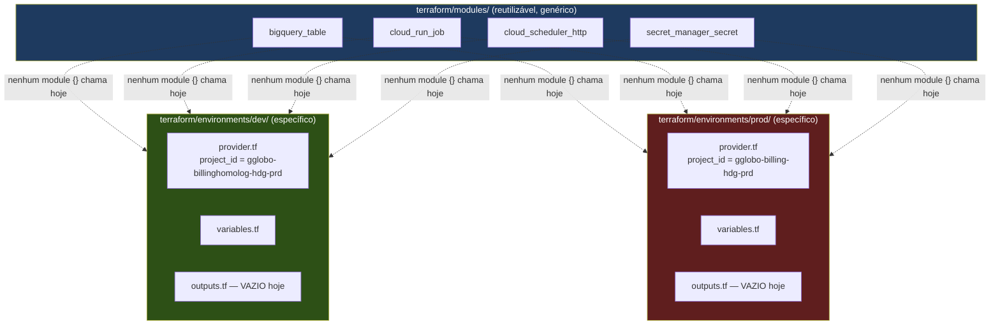

# Terraform 101 — finops-billing

> Para quem nunca usou Terraform. Se você só conhece Python/SQL e nunca tocou em infraestrutura
> como código, este documento é o ponto de partida. Ele explica os conceitos do zero **usando
> sempre o código real deste repositório como exemplo** — nada de exemplo abstrato de tutorial
> genérico da internet.
>
> Lido para escrever este documento: todo `terraform/modules/` (`bigquery_table`, `cloud_run_job`,
> `cloud_scheduler_http`, `secret_manager_secret` — `main.tf`, `variables.tf`, `outputs.tf` de cada
> um) e todo `terraform/environments/{dev,prod}/` (`provider.tf`, `variables.tf`, `outputs.tf`,
> `config/backend.conf`). Comandos `terraform init -backend=false`, `terraform validate` e
> `terraform fmt -check -recursive` foram executados e confirmados com sucesso em
> `terraform/environments/dev/` e em cada um dos 4 módulos isoladamente — **nunca** em
> `terraform/environments/prod/` (ver regra de segurança abaixo).
>
> Este documento **não substitui** o [`docs/DEPLOYMENT.md`](DEPLOYMENT.md) — aquele cobre o
> estado geral de deploy do repositório (CI, gaps, o que falta para as 5 camadas do medalhão
> terem deploy real). Este aqui é só sobre Terraform: o que é, como este repositório usa, e como
> rodar comandos nele com segurança.

---

## 🚨 Regra de segurança nº 1 deste documento — leia antes de tudo

**Nunca execute nenhum comando `terraform` (nem `init`, nem `validate`, nem `fmt -check`, nem
absolutamente nada) dentro de `terraform/environments/prod/`.**

Isso não é exagero. Mesmo comandos considerados "seguros" em teoria (`terraform init
-backend=false`, `terraform validate`) ainda tocam arquivos locais (`.terraform/`,
`.terraform.lock.hcl`) e, dependendo do que vier depois, podem evoluir sem querer para um
`terraform plan` ou `apply` contra o ambiente de produção real (projeto GCP
`gglobo-billing-hdg-prd`). A forma mais segura de nunca cometer esse erro é **nunca digitar
`terraform` com o diretório atual dentro de `prod/`**, ponto final.

Toda vez que este documento mostrar um comando de exemplo, ele usa
`terraform/environments/dev/`. Se você precisar mesmo de algo em produção, **pare e peça revisão
de alguém mais sênior do time antes de rodar qualquer coisa** — não existe comando "rápido e
inofensivo" o suficiente para justificar pular essa revisão.

Esta regra volta a aparecer em todas as seções relevantes deste documento, de propósito.

---

## 1. O que é Terraform, em 1 parágrafo

Terraform é uma ferramenta de **Infrastructure as Code (IaC)**: em vez de você entrar no Console
do GCP e clicar para criar uma tabela do BigQuery, um Cloud Run Job ou um Cloud Scheduler, você
**descreve esses recursos em arquivos de texto** (extensão `.tf`, na linguagem HCL — HashiCorp
Configuration Language) e o Terraform cuida de criar, atualizar ou destruir o que for necessário
para que a infraestrutura real bata com o que está escrito nesses arquivos. O fluxo de trabalho
tem três momentos-chave: você escreve/edita um `.tf`, roda `terraform plan` para ver **uma
prévia** do que vai mudar (sem mudar nada de fato — é como um `git diff` da infraestrutura), e só
depois roda `terraform apply` para aplicar essa mudança de verdade. O Terraform guarda um
**state** (registro do que já foi criado e com quais parâmetros) para saber, na próxima vez, o
que já existe e o que precisa mudar.

---

## 2. Conceitos mínimos para entender este repositório

Cada conceito abaixo é explicado direto com o exemplo real deste repositório — não há nenhum
conceito aqui que não seja usado em `terraform/`.

### Provider

O **provider** é o "plugin" que ensina o Terraform a falar com uma nuvem específica. Este
repositório usa só o provider `google` (Google Cloud), declarado em
`terraform/environments/dev/provider.tf`:

```hcl
provider "google" {
  project = var.project_id
  region  = var.region
}

terraform {
  required_providers {
    google = {
      source  = "hashicorp/google"
      version = "~> 6.0"
    }
  }

  backend "gcs" {
  }
}
```

`~> 6.0` significa "qualquer versão 6.x, mas não a 7.0" — trava a versão major do provider para
evitar que uma atualização grande quebre o código sem aviso.

### Resource

Um **resource** é uma peça concreta de infraestrutura: uma tabela do BigQuery, um Cloud Run Job,
um agendamento do Cloud Scheduler, um secret. Exemplo real, de
`terraform/modules/bigquery_table/main.tf`:

```hcl
resource "google_bigquery_table" "this" {
  project     = var.project_id
  dataset_id  = var.dataset_id
  table_id    = var.table_id
  description = var.description

  time_partitioning {
    type  = var.time_partitioning_type
    field = var.time_partitioning_field
  }

  clustering          = var.clustering
  deletion_protection = var.deletion_protection
  schema              = var.schema
}
```

`google_bigquery_table` é o tipo de recurso (definido pelo provider `google`); `"this"` é o nome
local que esse recurso recebe dentro do módulo (convenção comum quando o módulo só tem um recurso
desse tipo).

### Module

Um **module** é um "pacote" reutilizável de recursos, com entradas (`variables`) e saídas
(`outputs`) bem definidas — o equivalente a uma função em Python, mas para infraestrutura. Este
repositório tem 4 módulos em `terraform/modules/` (tour completo na seção 4). Um ambiente
**chamaria** um módulo assim (exemplo ilustrativo — ver seção 8 para o caso real):

```hcl
module "tabela_billing_silver" {
  source     = "../../modules/bigquery_table"
  project_id = var.project_id
  dataset_id = "billing_silver"
  table_id   = "gcp_billing_silver_label"
  # ...
}
```

### Variable

Uma **variable** é um parâmetro de entrada — o equivalente a um argumento de função. Declarada em
`variables.tf`, com tipo e (opcionalmente) valor padrão (`default`). Exemplo real de
`terraform/environments/dev/variables.tf`:

```hcl
variable "project_id" {
  type        = string
  description = "Projeto GCP de dev (homologação)."
  default     = "gglobo-billinghomolog-hdg-prd"
}
```

Todas as 4 variáveis de `dev/variables.tf` e `prod/variables.tf` têm `default` definido —
nenhuma é obrigatória de passar na linha de comando hoje.

### Output

Um **output** é um valor que o Terraform expõe depois de criar os recursos — por exemplo, o ID
gerado de uma tabela ou a URL de um Cloud Run Job. Útil para outro processo (CI/CD, outro módulo,
ou um humano) consultar sem precisar abrir o Console. Exemplo real de
`terraform/modules/bigquery_table/outputs.tf`:

```hcl
output "id" {
  value = google_bigquery_table.this.id
}

output "table_id" {
  value = google_bigquery_table.this.table_id
}

output "self_link" {
  value = google_bigquery_table.this.self_link
}
```

Hoje, `terraform/environments/dev/outputs.tf` e `terraform/environments/prod/outputs.tf` estão
**vazios** — porque nenhum módulo está instanciado em nenhum dos dois ambientes ainda (mais
detalhe na seção 3). O comentário que já existe nesses dois arquivos deixa isso explícito:

```hcl
# Vazio por enquanto: nenhum módulo é instanciado neste ambiente. Ao adicionar
# o primeiro módulo (ex.: deploy das camadas do medalhão), exportar aqui os
# IDs/URLs úteis — nunca deixar output órfão sem motivo (ver débito técnico #6
# do legado em CLAUDE.md).
```

### Backend remoto (state em GCS)

O **state** é o arquivo (`terraform.tfstate`) onde o Terraform registra o que já foi criado. Se
esse arquivo ficasse só na sua máquina, ninguém mais do time saberia o que já existe — e duas
pessoas rodando `apply` ao mesmo tempo poderiam se atropelar. Por isso, o state deste repositório
fica num **backend remoto**: um bucket do Google Cloud Storage (GCS), compartilhado pelo time.

Isso é declarado em `provider.tf` com `backend "gcs" {}` — propositalmente vazio no código-fonte,
porque o bucket e o prefixo (caminho dentro do bucket) são informados **na hora do `init`**, via
um arquivo `backend.conf` que já existe em cada ambiente:

`terraform/environments/dev/config/backend.conf`:
```hcl
bucket = "backend-finops-terraform"
prefix = "finops-billing/dev"
```

`terraform/environments/prod/config/backend.conf`:
```hcl
bucket = "backend-finops-terraform"
prefix = "finops-billing/prod"
```

Ou seja: dev e prod usam o **mesmo bucket** (`backend-finops-terraform`), mas em **prefixos
(pastas) diferentes** dentro dele — o que mantém os states de dev e prod completamente isolados
um do outro, mesmo compartilhando o bucket físico.

### `.tfvars`

Um arquivo `.tfvars` é onde você normalmente colocaria valores de `variables` específicos de um
ambiente (em vez de usar os `default`). **Este repositório não tem nenhum arquivo `.tfvars`
hoje** — todas as variáveis já têm `default` definido diretamente em `variables.tf` de cada
ambiente, então não há necessidade de um `.tfvars` para os casos de uso atuais. Se isso mudar
(por exemplo, uma variável sensível que não deveria ter `default` versionado), é nesse arquivo
que o valor entraria — e ele **nunca** deve ser commitado se contiver segredo.

---

## 3. Como este repositório usa Terraform



As linhas pontilhadas no diagrama são **intencionais**: hoje **nenhum módulo é instanciado** em
nenhum dos dois ambientes. Não existe, em nenhum arquivo de `terraform/environments/{dev,prod}/`,
nenhum bloco `module "..." { source = "../../modules/..." }`. Os 4 módulos existem, são válidos
(`terraform validate` passa em cada um isoladamente) e estão prontos para uso — mas hoje são
**fundação sem consumidor**, esperando o dia em que alguma das 5 camadas do medalhão
(`silver`, `gold_pre_foundation`, `gold_foundation`, `gold`, `unificado`) ganhar deploy real via
Terraform.

### Por que essa separação módulos/ambientes existe

O `CLAUDE.md` deste repositório documenta os débitos técnicos do legado (`gcp-billing`) que essa
estrutura foi desenhada para **não repetir**:

- Legado: Terraform **assimétrico** entre dev (modular) e prod (`main.tf` monolítico). Aqui: dev
  e prod têm exatamente a mesma estrutura de arquivos (`provider.tf`, `variables.tf`,
  `outputs.tf`) e, quando um módulo for adicionado, será adicionado **nos dois** com o mesmo
  `source`.
- Legado: ausência de módulos reutilizáveis para recursos repetidos (cada Cloud Function tinha
  seu próprio bloco de recurso copiado e colado). Aqui: os 4 módulos existem exatamente para
  resolver isso — qualquer camada nova que precisar de uma tabela do BigQuery ou um Cloud Run Job
  reaproveita `bigquery_table`/`cloud_run_job`, em vez de duplicar HCL.
- Legado: `outputs.tf` vazio sem motivo. Aqui: vazio hoje **com motivo documentado no próprio
  arquivo** (nenhum módulo instanciado ainda) — e os módulos já têm outputs prontos para serem
  expostos no dia em que forem chamados.

---

## 4. Tour pelos 4 módulos existentes

Todos vivem em `terraform/modules/<nome>/`, cada um com `main.tf` (o que cria), `variables.tf`
(entradas) e `outputs.tf` (saídas).

### 4.1 `bigquery_table`

**O que cria:** uma tabela do BigQuery (`google_bigquery_table`), com particionamento por tempo,
clustering opcional e proteção contra deleção acidental.

**Variáveis principais:**

| Variável | Obrigatória? | Default | Descrição |
|---|---|---|---|
| `project_id` | Sim | — | Projeto GCP onde a tabela é criada |
| `dataset_id` | Sim | — | Dataset já existente (não é criado por este módulo) |
| `table_id` | Sim | — | ID da tabela |
| `schema` | Sim | — | Schema como JSON (`jsonencode` de uma lista de campos) |
| `time_partitioning_field` | Sim | — | Campo TIMESTAMP/DATE usado para particionar |
| `description` | Não | `""` | Descrição da tabela |
| `time_partitioning_type` | Não | `"DAY"` | Tipo de particionamento (`DAY`, `MONTH`, ...) |
| `clustering` | Não | `[]` | Campos de clustering, em ordem de prioridade |
| `deletion_protection` | Não | `true` | Se `true`, Terraform bloqueia deleção acidental |

**Outputs:** `id`, `table_id`, `self_link`.

**Nota de segurança:** `deletion_protection` vem `true` por default — ou seja, mesmo que alguém
rode `terraform destroy` por engano num ambiente onde esse módulo estivesse instanciado, o
provider bloquearia a deleção da tabela até essa proteção ser explicitamente desligada.

### 4.2 `cloud_run_job`

**O que cria:** um Cloud Run Job (`google_cloud_run_v2_job`) — o runtime candidato para executar
o código Python de cada camada do medalhão (alternativa a Cloud Function, que é o que o legado
usa).

**Variáveis principais:**

| Variável | Obrigatória? | Default | Descrição |
|---|---|---|---|
| `project_id` | Sim | — | Projeto GCP |
| `region` | Sim | — | Região do Job |
| `name` | Sim | — | Nome do Job |
| `image` | Sim | — | Imagem do container (Artifact Registry) |
| `service_account_email` | Sim | — | Service Account usada na execução |
| `env_vars` | Não | `{}` | Variáveis de ambiente do container (`map(string)`) |
| `cpu` | Não | `"1"` | Limite de CPU |
| `memory` | Não | `"512Mi"` | Limite de memória |
| `timeout` | Não | `"600s"` | Timeout por task |
| `max_retries` | Não | `1` | Tentativas adicionais em caso de falha |

**Outputs:** `id`, `name`.

**Detalhe importante:** o módulo tem um bloco `lifecycle { ignore_changes = [...] }` que faz o
Terraform **ignorar** mudanças na imagem do container depois do primeiro `apply`:

```hcl
lifecycle {
  ignore_changes = [
    template[0].template[0].containers[0].image,
  ]
}
```

Isso significa que, depois que o Job existe, **atualizar a imagem (ex.: deploy de uma nova versão
do código Python) não é feito via `terraform apply`** — seria via `gcloud run jobs update
--image=<nova_imagem>` (ou um pipeline de CI/CD de imagem separado). O Terraform continua
controlando todo o resto da configuração do Job (CPU, memória, variáveis de ambiente, Service
Account), só não a imagem.

### 4.3 `cloud_scheduler_http`

**O que cria:** um agendamento do Cloud Scheduler (`google_cloud_scheduler_job`) que dispara uma
chamada HTTP `POST` autenticada via OIDC — o padrão para "rodar este pipeline todo dia às Xh".

**Variáveis principais:**

| Variável | Obrigatória? | Default | Descrição |
|---|---|---|---|
| `project_id` | Sim | — | Projeto GCP |
| `region` | Sim | — | Região do Scheduler |
| `name` | Sim | — | Nome do job de agendamento |
| `schedule` | Sim | — | Expressão cron (ex.: `"0 6 * * *"`) |
| `uri` | Sim | — | URI HTTP alvo (ex.: a API `:run` de um Cloud Run Job) |
| `service_account_email` | Sim | — | Service Account usada para autenticar via OIDC |
| `audience` | Sim | — | Audience do token OIDC |
| `description` | Não | `""` | Descrição do job |
| `time_zone` | Não | `"America/Sao_Paulo"` | Fuso horário do cron |

**Outputs:** `id`, `name`.

**Detalhe de segurança:** a autenticação é via **OIDC token** (`oidc_token { service_account_email
= ...; audience = ... }`), não via chave de API estática — o Scheduler se autentica como a
Service Account na hora de chamar o endpoint, sem segredo nenhum trafegando.

### 4.4 `secret_manager_secret`

**O que cria:** o **container** de um secret no Secret Manager (`google_secret_manager_secret`)
mais o IAM necessário para Service Accounts específicas lerem esse secret
(`google_secret_manager_secret_iam_member`, papel `roles/secretmanager.secretAccessor`).

**O que NÃO cria, de propósito:** o **valor** do secret. O comentário no topo do `main.tf` é
explícito sobre isso:

```hcl
# Cria apenas o "container" do secret — a versão com o valor sensível nunca é
# gerenciada pelo Terraform (nunca commitada), é populada manualmente fora
# deste módulo, ex.: `gcloud secrets versions add <secret_id> --data-file=...`.
```

Ou seja: o Terraform cria o "cofre vazio"; alguém com permissão precisa rodar manualmente
`gcloud secrets versions add` para colocar o valor real dentro. Isso é proposital — segredo nunca
deve passar por um arquivo `.tf` versionado no Git.

**Variáveis principais:**

| Variável | Obrigatória? | Default | Descrição |
|---|---|---|---|
| `project_id` | Sim | — | Projeto GCP |
| `secret_id` | Sim | — | Nome do secret no Secret Manager |
| `accessor_service_account_emails` | Não | `[]` | Lista de Service Accounts com permissão de leitura (escopo mínimo, por secret — não a nível de projeto) |

**Outputs:** `secret_id`, `id`.

---

## 5. Como instalar e configurar o Terraform localmente

1. **Instale o Terraform CLI.** Instruções oficiais:
   https://developer.hashicorp.com/terraform/install
   Neste repositório, a versão usada e validada é a **v1.15.6**. Depois de instalar, confirme:

   ```bash
   terraform version
   ```

   Saída esperada (a versão exata pode variar um pouco, mas deve ser 1.x recente):
   ```
   Terraform v1.15.6
   on windows_amd64
   ```

2. **Autentique sua máquina no GCP**, se você for rodar `plan`/`apply` reais (não apenas
   `validate`/`fmt`). O Terraform usa as **Application Default Credentials** do `gcloud`:

   ```bash
   gcloud auth application-default login
   ```

   Isso abre o navegador para login. Sem isso, qualquer comando que precise falar com o GCP de
   verdade (`init` completo com backend real, `plan`, `apply`) vai falhar com erro de
   autenticação.

3. **Confirme o projeto e a conta corretos** antes de qualquer coisa que toque GCP real:

   ```bash
   gcloud config list
   ```

   Se o projeto ativo não for o que você espera usar (dev: `gglobo-billinghomolog-hdg-prd`),
   ajuste com `gcloud config set project gglobo-billinghomolog-hdg-prd` — mas lembre-se que o
   `project_id` real usado pelo Terraform vem das variáveis em `variables.tf`, não do
   `gcloud config`, então isso só afeta comandos `gcloud` manuais, não o Terraform em si.

---

## 6. Passo a passo seguro para validar mudanças (sempre em `dev/`)

🚨 **Repetindo a regra de segurança nº 1: todos os comandos abaixo são para
`terraform/environments/dev/`. Nunca rode nada disto dentro de `terraform/environments/prod/`.**

### 6.1 `terraform init -backend=false` — só para checar sintaxe

Use este modo quando você só quer validar que o HCL está sintaticamente correto e os módulos
resolvem (sem tocar o backend real do GCS, sem precisar de credenciais GCP). É o comando mais
seguro que existe — não faz nenhuma chamada de rede para GCP, só baixa os providers necessários.

```bash
cd terraform/environments/dev
terraform init -backend=false -input=false
```

Isso já foi executado neste repositório com sucesso (sem credenciais GCP, sem tocar
infraestrutura real).

### 6.2 `terraform init` completo — configura o backend GCS real

Quando você precisar mesmo rodar um `plan`/`apply` de verdade (ou só inspecionar o state real),
use o `init` completo, **passando o arquivo de backend correto do ambiente**:

```bash
cd terraform/environments/dev
terraform init -backend-config=config/backend.conf
```

Isso conecta o Terraform ao bucket GCS real (`backend-finops-terraform`, prefixo
`finops-billing/dev`) e baixa/atualiza o state daquele ambiente. **Diferença chave**: o `init`
completo pode exigir autenticação GCP válida (`gcloud auth application-default login`, seção 5) e
de fato sincroniza com o bucket remoto — não é mais "só sintaxe", é "estou pronto para consultar
ou mudar infraestrutura real". Use o `-backend=false` (seção 6.1) sempre que só precisar validar
HCL; use o `init` completo só quando realmente for inspecionar/planejar/aplicar contra o
ambiente.

### 6.3 `terraform validate`

Verifica que os arquivos `.tf` são sintaticamente válidos e internamente consistentes (tipos de
variável corretos, referências a recursos que existem, etc.). Não precisa de credenciais GCP nem
de backend configurado — funciona após qualquer um dos dois `init` acima.

```bash
terraform validate
```

Saída esperada (já confirmada neste repositório, tanto em `dev/` quanto em cada módulo
isoladamente):
```
Success! The configuration is valid.
```

### 6.4 `terraform fmt`

Formata os arquivos `.tf` no padrão oficial do HashiCorp (indentação, alinhamento). Para só
**checar** se algo está fora do padrão sem alterar nenhum arquivo:

```bash
terraform fmt -check -recursive
```

Sem saída e exit code `0` = tudo já formatado (estado atual confirmado de
`terraform/modules/` e `terraform/environments/dev/`). Se quiser efetivamente corrigir a
formatação (sem o `-check`):

```bash
terraform fmt -recursive
```

### 6.5 `terraform plan` — a prévia, ainda sem mudar nada

`plan` é **seguro de rodar** no sentido de que, por si só, ele nunca aplica nenhuma mudança —
só mostra o que **aconteceria** se você rodasse `apply` agora (recursos a criar, atualizar ou
destruir). Ainda assim, neste repositório, **por padrão só rode `plan` em `dev/`** a menos que
esteja explicitamente autorizado e acompanhado por alguém mais sênior a rodar contra `prod/`.

```bash
cd terraform/environments/dev
terraform init -backend-config=config/backend.conf
terraform plan
```

Hoje, como nenhum módulo está instanciado em `dev/`, o `plan` mostraria "No changes" (nada para
criar, atualizar ou destruir) — porque não há nenhum `resource`/`module` declarado ainda além de
`provider`/`variable`/`output` vazios.

---

## 7. `terraform apply` — o comando que realmente muda infraestrutura

`apply` é o comando que **executa de fato** o que o `plan` mostrou como prévia: cria, atualiza ou
destrói recursos reais no GCP. Isso tem peso real — pode gerar custo, pode indisponibilizar algo
que já está em produção, pode (se mal configurado) até deletar dados.

Regras deste repositório para `apply`:

1. **Nunca rode `apply` sem ter revisado o `plan` correspondente antes**, linha por linha,
   prestando atenção especial em qualquer linha que comece com `-` (destruição) ou `~`
   (atualização in-place de algo que já existe).
2. **Em `dev/`**: ainda assim, trate como uma ação real — comunique ao time antes de aplicar algo
   novo, mesmo em homologação.
3. **Em `prod/`**: 🚨 **nunca execute `apply` sozinho.** Isso exige revisão e aprovação explícita
   de alguém mais sênior do time **antes** de rodar, sem exceção — mesmo que o `plan`
   correspondente pareça trivial ou óbvio. Não existe "mudança pequena demais" que justifique
   pular essa revisão em produção.

```bash
# Exemplo (ilustrativo, sempre em dev/, nunca em prod/ sem aprovação):
cd terraform/environments/dev
terraform plan -out=tfplan
# --- revisão humana do conteúdo do plano aqui ---
terraform apply tfplan
```

Usar `-out=tfplan` e depois `apply tfplan` (em vez de só `terraform apply`) garante que você está
aplicando **exatamente** o plano que foi revisado, sem risco de o estado real ter mudado entre a
revisão e a aplicação.

---

## 8. Como adicionar um novo módulo a um ambiente (exemplo ilustrativo)

⚠️ **O exemplo abaixo é ilustrativo de como o padrão funcionaria — não é uma instrução real
ainda.** Não existe hoje nenhum arquivo `silver.tf` em `terraform/environments/dev/`; isso é uma
demonstração de como, no futuro, alguém daria os primeiros passos de Terraform para uma das 5
camadas do medalhão (usando a camada Silver como exemplo, por ser a primeira da cadeia).

**Passo 1 — criar um arquivo novo no ambiente**, ex.:
`terraform/environments/dev/silver.tf`:

```hcl
module "tabela_silver_label" {
  source     = "../../modules/bigquery_table"
  project_id = var.project_id
  dataset_id = "billing_silver"
  table_id   = "gcp_billing_silver_label"

  description              = "Tabela silver de billing com labels normalizadas"
  schema                   = file("${path.module}/schemas/silver_label.json")
  time_partitioning_field  = "data_referencia"
  time_partitioning_type   = "DAY"
  clustering               = ["projeto_id"]
}
```

**Passo 2 — repetir exatamente o mesmo bloco em `terraform/environments/prod/silver.tf`**,
trocando só o que for específico do ambiente (geralmente nada, já que `project_id` já vem de
`var.project_id`). Isso preserva a simetria dev/prod que este repositório busca manter (ver
seção 3).

**Passo 3 — expor o output relevante** em `terraform/environments/dev/outputs.tf` (e no de
`prod/`):

```hcl
output "tabela_silver_label_id" {
  value = module.tabela_silver_label.id
}
```

**Passo 4 — validar com segurança, sempre em `dev/` primeiro:**

```bash
cd terraform/environments/dev
terraform init -backend=false -input=false   # checa sintaxe, sem tocar backend
terraform fmt -check -recursive
terraform validate
```

**Passo 5 — só depois, com backend real e credenciais, revisar o `plan`:**

```bash
terraform init -backend-config=config/backend.conf
terraform plan
```

**Passo 6 — `apply` em `dev/`** apenas depois de revisar o `plan` linha por linha (seção 7). Para
`prod/`, esse mesmo arquivo `silver.tf` só seria aplicado depois de aprovação explícita de alguém
mais sênior — nunca isoladamente por quem está aprendendo Terraform agora.

---

## 9. Erros comuns para quem nunca usou Terraform

| Erro | Causa provável | Solução |
|---|---|---|
| `Error: Backend configuration changed` | Você rodou `terraform init` sem `-backend-config` depois de já ter inicializado com um backend diferente (ou trocou de `-backend=false` para backend real sem reinicializar) | Rode `terraform init -reconfigure -backend-config=config/backend.conf` para forçar a reconfiguração do backend |
| `Error: Inconsistent dependency lock file` | O arquivo `.terraform.lock.hcl` foi gerado com uma versão/plataforma de provider diferente da que você está usando agora (comum ao trocar de máquina ou SO) | Rode `terraform init -upgrade` para regenerar o lock file de forma consistente com o ambiente atual |
| `Error: required variable not set` (ou prompt interativo pedindo um valor) | Você está chamando uma variável sem `default` e sem passar valor (via `-var`, `.tfvars` ou variável de ambiente `TF_VAR_*`) | Neste repositório isso não deveria ocorrer hoje — todas as 4 variáveis de `dev/variables.tf` e `prod/variables.tf` têm `default`. Se aparecer, confira se você está rodando os comandos dentro de `terraform/environments/{dev,prod}/` (e não em algum módulo isolado, que **não** tem defaults para `project_id`/`dataset_id`/etc., por design — módulos recebem isso de quem os chama) |
| `Error: Error acquiring the state lock` | Outra execução de `terraform plan`/`apply` ainda está em andamento (ou travou) usando o mesmo state remoto no GCS | Espere a outra execução terminar. Se tiver certeza de que não há ninguém rodando (ex.: processo travou e morreu sem liberar o lock), use `terraform force-unlock <LOCK_ID>` — **com cautela, e nunca em `prod/` sem confirmar com o time antes** |
| Você roda `terraform plan`/`apply` e o resultado parece "errado" (recursos que você não esperava aparecerem) | Você está no diretório errado (ex.: dentro de `terraform/modules/bigquery_table/` em vez de `terraform/environments/dev/`) — cada módulo isolado não tem o contexto completo do ambiente | Confirme com `pwd` (ou `Get-Location` no PowerShell) em qual diretório você está antes de rodar qualquer comando Terraform. Sempre os comandos reais (`plan`/`apply`) são rodados a partir de `terraform/environments/<ambiente>/`, nunca direto de dentro de `terraform/modules/<algum_modulo>/` |
| Diferença entre `-backend=false` e `init` completo não está clara | Confusão comum de quem está começando | `-backend=false`: só baixa providers e resolve módulos, **não** toca o GCS real, não precisa de credenciais GCP — use para checar sintaxe (`validate`, `fmt`). `init` completo (com `-backend-config=config/backend.conf`): conecta no bucket GCS real do ambiente, pode exigir `gcloud auth application-default login` — use só quando for de fato consultar/planejar/aplicar contra a infraestrutura real |
| Comando Terraform "trava" sem terminar | Geralmente está esperando autenticação interativa, ou esperando lock de state (ver acima) | Cancele com `Ctrl+C`, confirme autenticação (`gcloud auth application-default login`) e tente de novo. Se for lock, veja a linha de `state lock` acima |

---

## 10. Glossário rápido

| Termo | O que é, em uma linha |
|---|---|
| **state** | Arquivo onde o Terraform registra o que já foi criado e com quais parâmetros |
| **plan** | Prévia do que vai mudar — não altera nada, é seguro de rodar |
| **apply** | Aplica de fato as mudanças mostradas no `plan` — muda infraestrutura real |
| **provider** | Plugin que ensina o Terraform a falar com uma nuvem específica (aqui: `google`) |
| **module** | Pacote reutilizável de recursos, com entradas e saídas definidas — como uma função |
| **resource** | Uma peça concreta de infraestrutura (uma tabela, um Job, um secret) |
| **output** | Valor exposto depois de criar os recursos (ex.: o ID de uma tabela) |
| **backend** | Onde o `state` é armazenado — aqui, um bucket remoto no GCS, compartilhado pelo time |
| **lock file** (`.terraform.lock.hcl`) | Registro das versões exatas de provider usadas, para builds reproduzíveis |

---

## 11. FAQ

**`apply` vai deletar meus dados?**
Só se o `plan` mostrar uma destruição (`-`) de um recurso que contém dados, e você confirmar isso
com `apply`. Para tabelas do BigQuery criadas pelo módulo `bigquery_table`, a variável
`deletion_protection` vem `true` por default — o que bloqueia esse tipo de deleção acidental até
alguém desligar essa proteção explicitamente. Mesmo assim: **sempre leia o `plan` antes de
aplicar**, nunca confie só no default de proteção.

**Posso rodar isso sem medo?**
`terraform init -backend=false`, `terraform validate` e `terraform fmt -check` em
`terraform/environments/dev/` ou em qualquer módulo isolado: sim, são seguros, não tocam
infraestrutura real. `terraform plan` com backend real: sim, é seguro no sentido de não mudar
nada, mas já toca o state remoto (leitura) — ainda assim, sem medo de estragar algo, só não rode
em `prod/` sem autorização. `terraform apply`: não é "sem medo" — é uma ação real, sempre revise
o `plan` antes, e em `prod/` nunca sem aprovação explícita de alguém mais sênior.

**O que acontece se eu rodar `plan` por engano em `prod/`?**
`plan` por si só não aplica nenhuma mudança — não deveria causar dano à infraestrutura. Mas a
regra deste repositório é mais conservadora que isso: **não execute nenhum comando Terraform em
`terraform/environments/prod/`, nem mesmo `plan`**, porque (a) ele ainda pode falhar de formas
inesperadas se você não tiver certeza do estado do backend, e (b) o hábito de "só vou dar uma
olhadinha em prod" é exatamente o tipo de hábito que este documento existe para evitar. Se isso
acontecer, **não rode `apply` em seguida** e avise o time — só ver o `plan` não deveria ter
mudado nada, mas vale confirmar com alguém mais sênior.

**Quem aprova mudança em `prod/`?**
⚠️ A confirmar com o time — este repositório não documenta hoje (nem em `CLAUDE.md`, nem em
`.gitlab-ci.yml`, nem em nenhum `CODEOWNERS`) um processo formal de aprovação para `terraform
apply` em produção. Até essa confirmação existir, trate como regra mínima: **nenhuma mudança em
`prod/` sem revisão explícita de alguém mais sênior do time antes de aplicar**, mesmo sem um
processo formalizado em ferramenta.

**Por que `terraform/environments/{dev,prod}/outputs.tf` estão vazios?**
Porque nenhum módulo está instanciado em nenhum dos dois ambientes ainda (seção 3). O próprio
arquivo tem um comentário explicando isso e o débito técnico do legado que essa decisão evita
(`outputs.tf` vazio sem motivo, item 6 do `CLAUDE.md`).

**Onde fica o state hoje, de verdade?**
Bucket GCS `backend-finops-terraform`, prefixo `finops-billing/dev` (ambiente dev) e
`finops-billing/prod` (ambiente prod) — conforme `terraform/environments/{dev,prod}/config/backend.conf`.
Mesmo bucket físico, prefixos diferentes, state completamente isolado entre os dois ambientes.

**Como eu rodaria isso pela primeira vez na minha máquina, do zero?**
1. Instale o Terraform (seção 5) e confirme `terraform version`.
2. Rode `gcloud auth application-default login` se for tocar GCP real.
3. `cd terraform/environments/dev`
4. `terraform init -backend=false -input=false` (só para validar sintaxe, sem tocar backend) —
   ou `terraform init -backend-config=config/backend.conf` se for de fato consultar/planejar
   contra o ambiente real.
5. `terraform validate` e `terraform fmt -check -recursive`.
6. Pare aqui a menos que tenha um motivo real para `plan`/`apply` — e nunca em `prod/`.

**Existe `terraform/environments/homologação`, além de dev e prod?**
Não — `dev` é o nome usado neste repositório para o ambiente de homologação
(`project_id = gglobo-billinghomolog-hdg-prd`, conforme o `description` da própria variável em
`terraform/environments/dev/variables.tf`: "Projeto GCP de dev (homologação)"). Não existe um
terceiro ambiente.

---

## Referência cruzada

- [`docs/DEPLOYMENT.md`](DEPLOYMENT.md) — estado geral de deploy do repositório (CI, gaps,
  roadmap de deploy real para as 5 camadas do medalhão). Leia esse documento para entender **o
  que falta** para haver deploy real; leia este (`TERRAFORM.md`) para entender **como usar a
  ferramenta** quando esse dia chegar.
- [`CLAUDE.md`](../CLAUDE.md) — contexto de negócio, débitos técnicos do legado que esta estrutura
  Terraform foi desenhada para não repetir.
